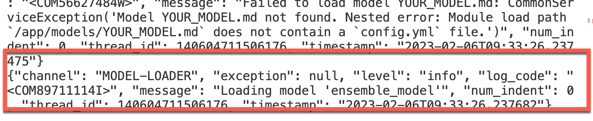

# Save your custom model here

Yon need to create or download a custom model and save the model in this folder.

> Please note that Docker has enough memory to load the model. So clean all container images and running containers.

Your archive file must be named as your model and not contain any file extension!

Example:
* `ensemble_model` -> **OK**
* `ensemble_model_custom` -> **will likely fail**
* `ensemble_model.zip` -> **will likely fail**

Ensure you find this message `"Loading model 'your_modelname'"`:

